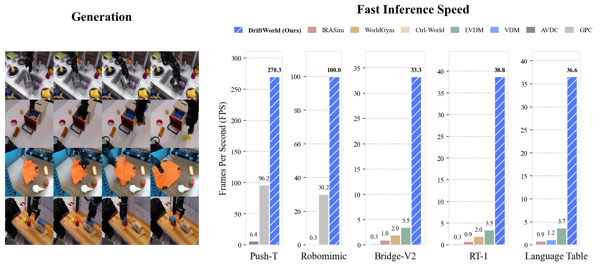

<div align="center">
<h2 style="margin-bottom: 0.3em;">DriftWorld: Fast World Modeling through Drifting</h2>
<p style="margin: 0.3em 0;">Susie Lu, Haonan Chen, Weirui Ye, Yilun Du</p>
<p style="margin: 0.3em 0;"><a href="https://arxiv.org/abs/2607.15065">Paper</a> | <a href="https://susie-lu.github.io/driftworld/">Project Page</a></p>
</div>

This codebase contains the official implementation for the DriftWorld paper.



### Setup and Checkpoints

You can install the relevant libraries by running `conda env create -f driftworld/environment.yml`.

| Link | Description |
|---|---|
| [DriftWorld](https://huggingface.co/Susie-Lu/driftworld) | Pretrained checkpoints |
| [Push-T Dataset](https://huggingface.co/datasets/han2019/gpc_pushT_data/tree/main/world_model_data) | Dataset for training on Push-T |
| [Robomimic Dataset](https://huggingface.co/datasets/robomimic/robomimic_datasets/tree/main/v1.5) | Dataset for training on Robomimic |
| [Bridge-V2](https://rail.eecs.berkeley.edu/datasets/bridge_release/data/tfds/bridge_dataset/) | Dataset for training on Bridge-V2 |
| [RT-1](https://console.cloud.google.com/storage/browser/gresearch/robotics/fractal20220817_data/0.1.0) | Dataset for training on RT-1 |
| [Language Table](https://huggingface.co/datasets/IPEC-COMMUNITY/language_table_lerobot/tree/main) | Dataset for training on Language Table |

### DriftWorld on Push-T
The folder `driftworld` contains the code for training and evaluating DriftWorld on Push-T. Please put the pretrained checkpoints in the folder `driftworld/pusht_checkpoints`, and put the dataset in the folder `driftworld/pusht_data`.

**To train DriftWorld:**
- Run `torchrun --nproc_per_node=2 main_train.py --config-name=pushT_driftworld`. Experiments were run on 2 H100 GPUs.

**To visualize generated videos:**
- Run `python main_vis.py` to generate videos using DriftWorld.

**To evaluate visual quality metrics:**
- Run `python main_eval_metrics.py`. This will compute the MSE, SSIM, PSNR, and LPIPS metrics on the generated videos.

**To evaluate DriftWorld's performance on policy improvement:**
- Run `main_gpc_rank.py` using the instructions in the file. This will compute the IoU score of a baseline policy after applying inference-time policy improvement by rolling out action proposals in DriftWorld and selecting the best ones.

**To evaluate DriftWorld's performance on policy evaluation:** 
- Run `python main_policy_eval.py`. This will compute the IoU scores of the policy when rolled out in DriftWorld, compared to the ground-truth IoU scores.

### DriftWorld on the other datasets
Will be added soon!

### Citation

If you find this work useful in your research, please consider citing:
```bib
@article{lu2026driftworld,
  title={DriftWorld: Fast World Modeling through Drifting},
  author={Lu, Susie and Chen, Haonan and Ye, Weirui and Du, Yilun},
  journal={arXiv preprint arXiv:2607.15065},
  year={2026}
}
```
